# Data Quality Intelligence Platform

## Overview

Data preparation is often one of the most time-consuming parts of a data workflow. Before analysis or machine learning, datasets commonly contain:

- Missing values
- Duplicate records
- Invalid values such as malformed emails
- Inconsistent text formatting
- Statistical outliers
- Unnecessary columns
- Different data types and distributions

The **Data Quality Intelligence Platform** provides a single workflow to identify these problems, understand their impact, clean the dataset, and export the processed data and quality metadata.

### Core workflow

```text
Authenticate
    ↓
Upload CSV
    ↓
Profile Dataset
    ↓
Calculate Quality Scores
    ↓
Identify Data Quality Issues
    ↓
Apply Configurable Cleaning
    ↓
Recalculate Quality
    ↓
Undo / Restore if Required
    ↓
Export Dataset + Reports
```

---

## Key Features

### Authentication

The application uses JWT-based authentication. Users register, log in, receive an access token, and use authenticated API requests for dataset operations.

### Dataset Upload & Analytics

Users upload CSV datasets through the React interface. The backend stores the file, reads it with Pandas, records metadata, and generates an initial quality report.

The dashboard surfaces:

- Total datasets
- Cleaned and validated datasets
- Average quality score
- Dataset status distribution
- Recent datasets

### Data Profiling

Profiling provides dataset-level and column-level information, including:

- Row and column counts
- Data types
- Missing values
- Unique values
- Numeric statistics
- Dataset preview

### Quality Assessment

Each dataset receives four component scores:

| Metric | Meaning |
|---|---|
| Completeness | Measures missing values |
| Uniqueness | Measures duplicate rows |
| Validity | Checks supported validity rules such as email format |
| Consistency | Represents consistency checks |

The overall score is a weighted combination of these dimensions.

```text
Overall =
    0.30 × Completeness
  + 0.25 × Uniqueness
  + 0.25 × Validity
  + 0.20 × Consistency
```

The report also contains detected issues and actionable recommendations.

### Data Cleaning

The platform provides configurable cleaning operations.

**Remove Duplicates**

Uses Pandas duplicate detection and removes repeated records while preserving unique rows.

**Fill Missing Values**

Supports:

- Mean
- Median
- Mode
- Custom values
- Drop rows for selected columns

**Normalize Text**

Supports:

- Trim whitespace
- Lowercase
- Uppercase
- Title Case

**Outlier Detection**

Uses the IQR method:

```text
IQR = Q3 - Q1
Lower = Q1 - 1.5 × IQR
Upper = Q3 + 1.5 × IQR
```

**Remove Columns**

Users select unnecessary columns and remove them from the working dataset.

After a cleaning operation, the dataset is saved, metadata is updated, and the quality report is recalculated.

### Undo & Restore

The platform maintains two backup states:

- **Undo Last Action** — restores the dataset state immediately before the latest cleaning operation.
- **Restore Original** — restores the dataset exactly as it was when first uploaded.

### Export

Users can export:

- The processed CSV
- Profile information as JSON
- The quality report as JSON

## Screenshots

The screenshots below demonstrate the main end-to-end workflow of the platform.

### Authentication

#### Login

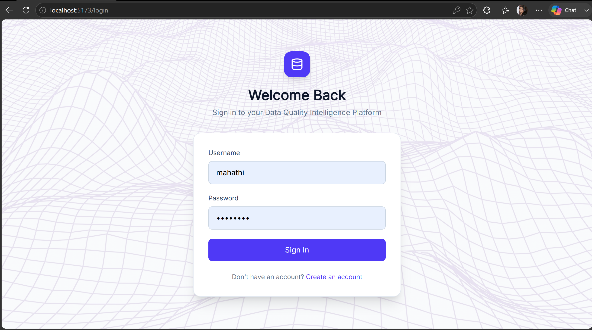

#### Registration

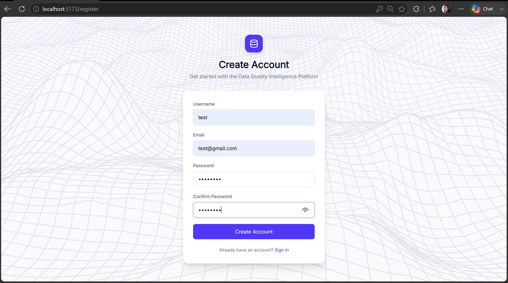

### Dashboard

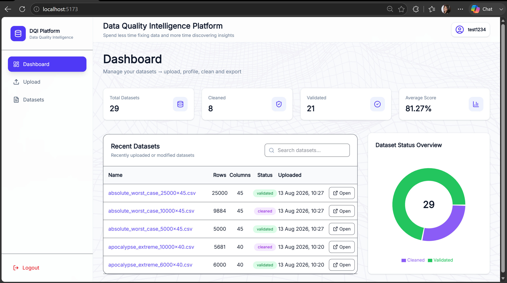

### Dataset Upload

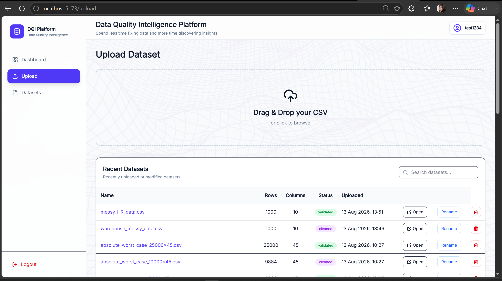

### Dataset Analytics

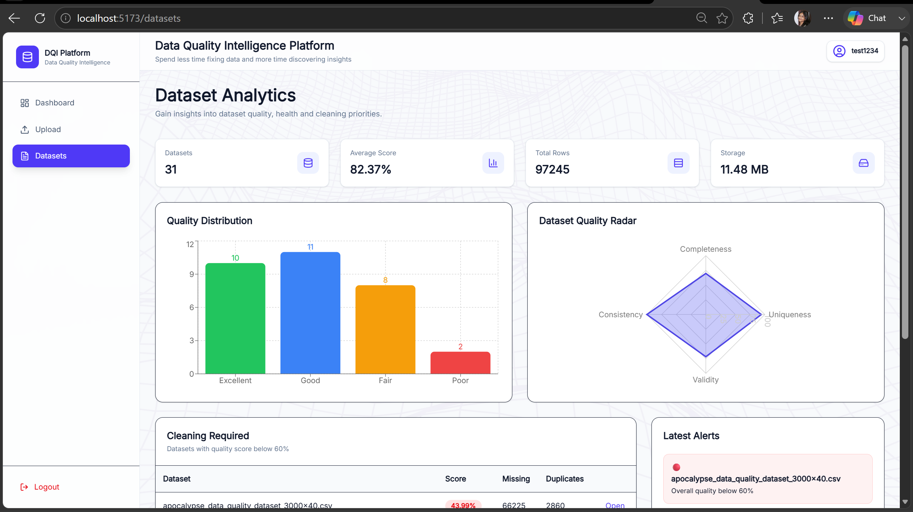

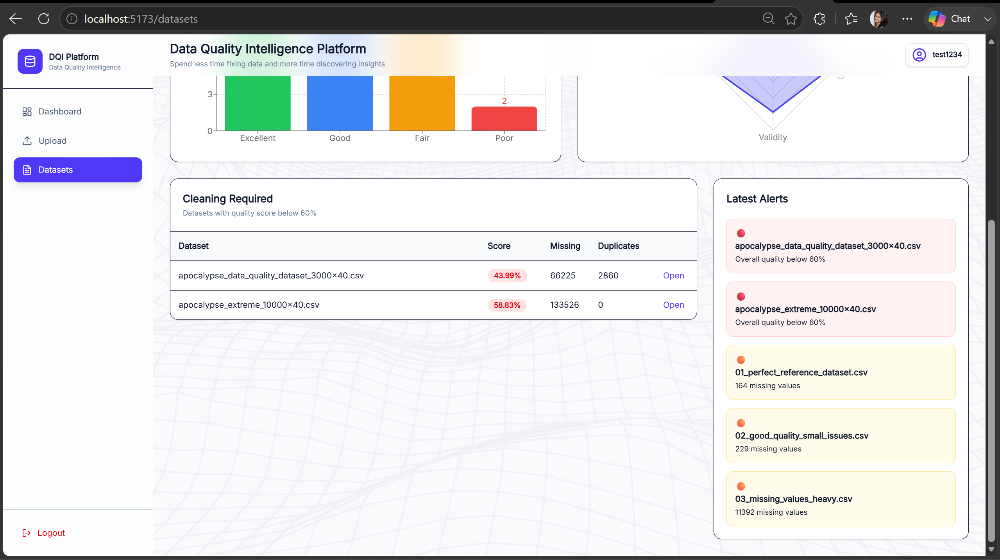

### Dataset Overview

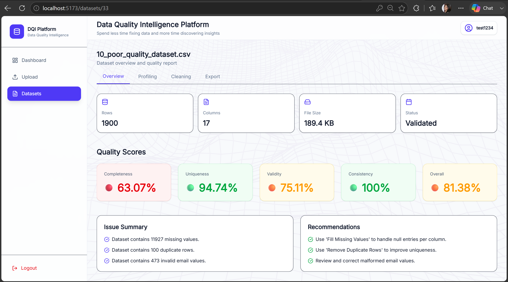

### Dataset Profiling

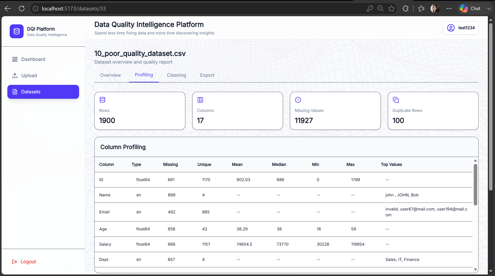

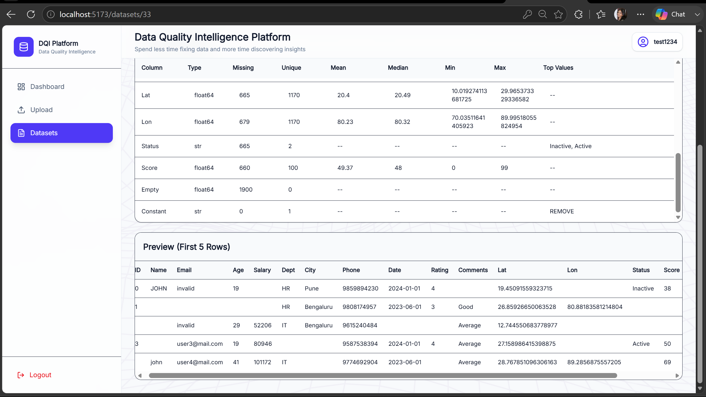

### Cleaning Actions

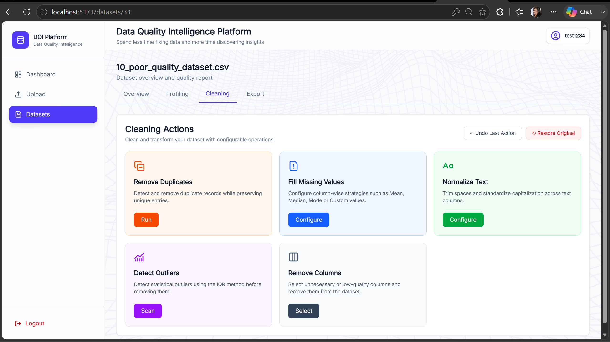

### Fill Missing Values

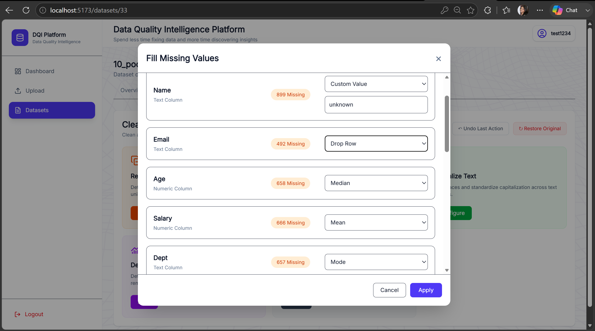

### Text Normalization

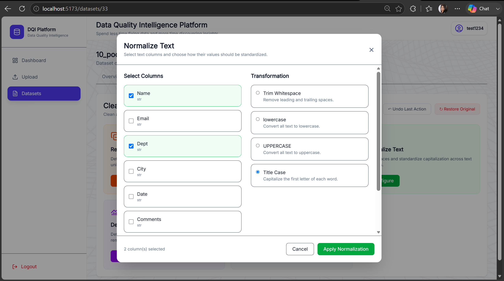

### Outlier Detection

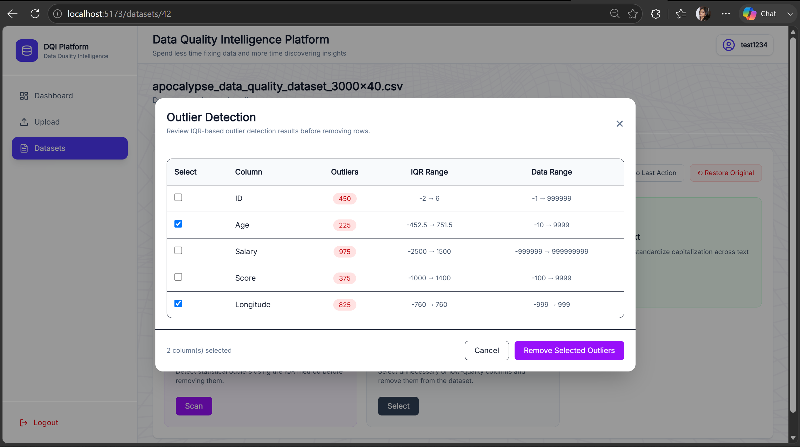

### Remove Columns

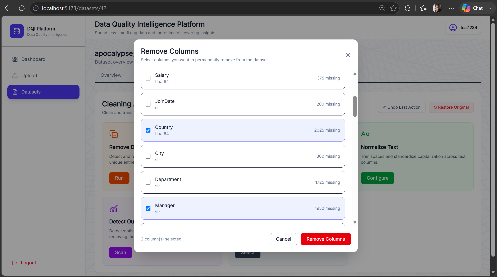

### Cleaning Results

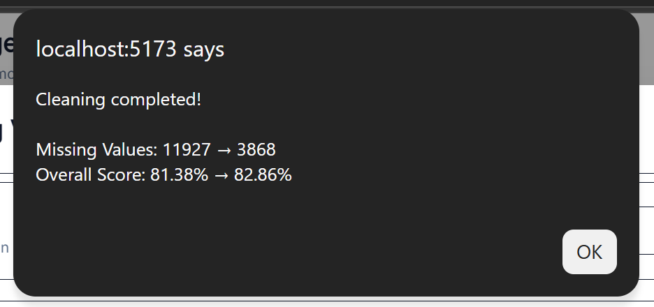

### Export

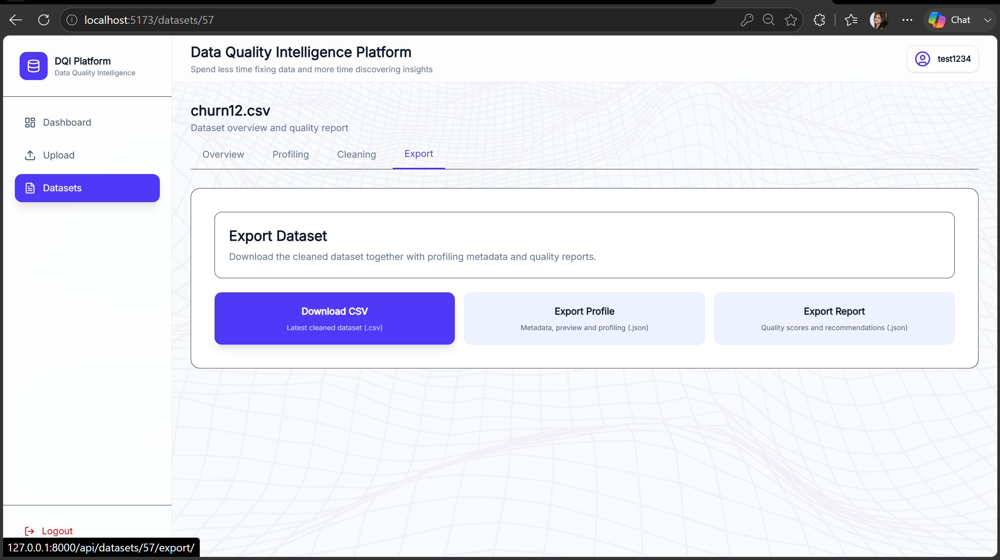

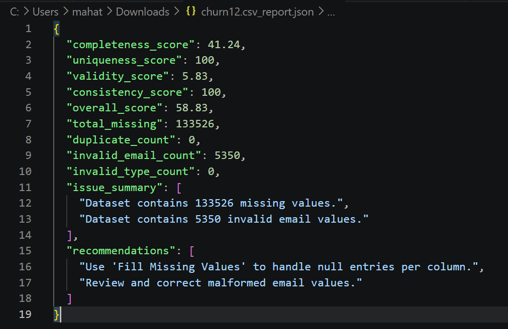


# Technical Architecture

```text
React Frontend
      |
      | REST / JSON / multipart upload
      v
Django REST Framework
      |
      +-----------------------------+
      |             |               |
 DatasetService  QualityService  CleaningService
      |             |               |
      +-------------+---------------+
                    |
                  Pandas
                    |
                PostgreSQL
```

## Technology Stack

### Frontend

- React
- JavaScript
- Vite
- Tailwind CSS
- Axios
- React Dropzone
- Lucide React

### Backend

- Python
- Django
- Django REST Framework
- SimpleJWT
- Gunicorn for deployment configuration

### Data Processing

- Pandas
- NumPy-compatible Pandas operations
- IQR-based statistical outlier detection

### Database

- PostgreSQL

### API Communication

Axios centralizes API requests and automatically attaches the JWT access token to authenticated requests.

The backend exposes endpoints for authentication, dashboards, datasets, profiling, reports, cleaning, undo/restore, outliers, renaming, deletion, and export.

# Backend Design

The backend follows a service-oriented structure so API views do not contain all of the CSV-processing logic.

### DatasetService

Responsible for:

- Loading CSV files into Pandas DataFrames
- Saving cleaned DataFrames
- Updating row, column, and file-size metadata
- Creating the permanent original backup
- Creating the one-level undo backup
- Restoring previous/original states
- Deleting dataset files and backups

### QualityService

Responsible for:

- Missing-value analysis
- Duplicate detection
- Email validity checks
- Quality-score calculation
- Issue summaries
- Cleaning recommendations

### CleaningService

Contains reusable DataFrame transformations for duplicates, missing values, text normalization, column removal, outlier detection, and outlier removal.

# Data Model

### Dataset

Stores:

- User ownership
- Dataset name
- Uploaded file
- Upload timestamp
- File size
- Row and column counts
- Processing status
- Initial quality metrics

### ValidationReport

Stores:

- Completeness score
- Uniqueness score
- Validity score
- Consistency score
- Overall score
- Missing-value count
- Duplicate count
- Invalid-email count
- Issue summary
- Recommendations

Each `Dataset` has one associated `ValidationReport`.

# Project Highlights

### Quality-first workflow

The project treats data quality as a measurable workflow rather than only a cleaning tool.

### Configurable cleaning

Users choose what to change instead of applying one fixed cleaning pipeline.

### Reversible transformations

Original and undo backups reduce the risk of destructive cleaning.

### Explainable quality reports

Scores are accompanied by issue summaries and recommendations.

### Exportable results

The processed dataset and quality information can be consumed outside the application.

# Suggested Repository Structure

```text
Data-Quality-Intelligence-Platform-V2/
├── frontend/
│   └── src/
├── backend/
│   ├── api/
│   ├── datasets/
│   └── data_quality_platform/
├── docs/
│   └── screenshots/
└── README.md
```

The screenshots used in this README are stored in `docs/screenshots/`.

# Running the Project

## Backend

```powershell
cd backend
python -m venv venv
venv\Scriptsctivate
pip install -r requirements.txt
python manage.py migrate
python manage.py runserver
```

Backend:

```text
http://127.0.0.1:8000/
```

## Frontend

```powershell
cd frontend
npm install
npm run dev
```

The Vite development server will display the frontend URL, typically:

```text
http://localhost:5173/
```

The frontend API client is configured to communicate with the local Django API.

# Environment Configuration

For local development, configure the Django settings for the local database and development environment.

Typical local configuration includes:

```text
DEBUG=True
DATABASE=PostgreSQL
BACKEND=http://127.0.0.1:8000
FRONTEND=http://localhost:5173
```

Do not commit real credentials or secret keys to the repository.

# API Flow

The main API flow is:

```text
Register
   ↓
Login → JWT access token
   ↓
Upload CSV
   ↓
Profile + quality report
   ↓
Clean / undo / restore
   ↓
Recalculate quality metrics
   ↓
Export
```

Important endpoints include:

```text
POST   /api/auth/register/
POST   /api/auth/login/

GET    /api/dashboard/
GET    /api/datasets/
POST   /api/datasets/upload/
GET    /api/profile/<id>/
GET    /api/datasets/<id>/report/

POST   /api/clean/<id>/
GET    /api/datasets/<id>/outliers/
POST   /api/datasets/<id>/undo/
POST   /api/datasets/<id>/restore/

PATCH  /api/datasets/<id>/rename/
DELETE /api/datasets/<id>/delete/
GET    /api/datasets/<id>/export/
```

# What I Learned

This project gave me practical experience with:

- Full-stack application architecture
- React and REST API integration
- Django REST Framework
- JWT authentication
- Pandas-based CSV processing
- Data profiling and quality metrics
- Statistical outlier detection
- Configurable data-cleaning workflows
- PostgreSQL data modelling
- Backup and restore workflows
- API-based export and error handling

# Future Improvements

- Excel and additional structured-data support
- More configurable validation rules
- Configurable quality-score weights
- Multi-level cleaning history
- Background processing for very large datasets
- Scheduled quality checks and quality trends
- Role-based access control
- Cloud object storage
- Advanced anomaly detection
- Custom data-quality rules

# Conclusion

The Data Quality Intelligence Platform combines data ingestion, profiling, quality assessment, cleaning, reversibility, and export into one workflow.

The main engineering focus was keeping the system modular: React handles the user experience, Django REST Framework exposes the API, service classes handle dataset operations and quality logic, Pandas performs the data transformations, and PostgreSQL stores application metadata and reports.

This makes the project suitable as a practical demonstration of full-stack development combined with data engineering and data-quality concepts.
